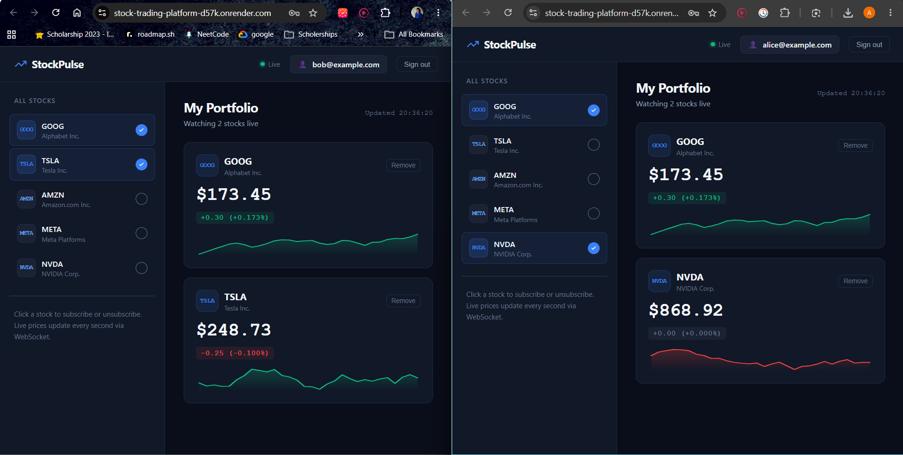

## Live Demo

- **Live server:** https://stock-trading-platform-d57k.onrender.com  
- **Deployment screenshot:**

   

Replace the URL above with your actual deployed site URL and add the screenshot file at `assets/deployment_screenshot.png` in the repository before committing.


# StockPulse — Live Stock Broker Dashboard

A real-time stock broker client web dashboard built for the CUPI Full-Stack Developer Assignment.

## Features

- **Email-based login** with JWT authentication
- **5 supported stocks**: GOOG, TSLA, AMZN, META, NVDA
- **Subscribe/unsubscribe** to stocks via a sidebar
- **Live price updates** every second using WebSockets — no page refresh needed
- **Multi-user support**: Alice and Bob can be logged in simultaneously with independent dashboards updating asynchronously
- **Visual indicators**: color-coded price changes, flash animations, sparkline charts
- **Auto-reconnect** if WebSocket connection drops
- **Persistent sessions** via localStorage (stay logged in on refresh)

## Tech Stack

| Layer     | Technology                              |
|-----------|-----------------------------------------|
| Backend   | Node.js, Express, `ws` (WebSocket)      |
| Auth      | JWT (`jsonwebtoken`), bcrypt            |
| Frontend  | Vanilla HTML/CSS/JavaScript             |
| Transport | REST API + WebSocket (real-time prices) |

## Architecture

```
Browser (User A)          Browser (User B)
     │                         │
     │  WebSocket               │  WebSocket
     ▼                         ▼
┌─────────────────────────────────────────┐
│           Node.js Server                │
│                                         │
│  REST API (/api/login, /subscribe ...)  │
│  WebSocket Server (ws://)               │
│  Price Simulator (every 1 second)       │
└─────────────────────────────────────────┘
```

**Price updates flow:**
1. Server runs a `setInterval` every 1 second, applying a random walk to all 5 stock prices.
2. For each connected WebSocket client, the server looks up that user's subscriptions and broadcasts only their subscribed stock prices.
3. The browser receives the price update and updates the DOM in real-time — no polling, no page refresh.

## Project Structure

```
stock-dashboard/
├── backend/
│   ├── server.js        # Express + WebSocket server
│   └── package.json
├── frontend/
│   └── index.html       # Single-page dashboard (HTML + CSS + JS)
└── README.md
```

## Setup & Run

### Prerequisites
- **Node.js** v16 or higher
- A modern web browser

### Step 1: Install backend dependencies

```bash
cd backend
npm install
```

### Step 2: Start the backend server

```bash
node server.js
```

You should see:
```
🚀 Stock Dashboard Server running on port 3001
📡 REST API:    http://localhost:3001/api
🔌 WebSocket:   ws://localhost:3001

👤 Demo users:
   alice@example.com / password123
   bob@example.com   / password123
```

### Step 3: Open the frontend

Open `frontend/index.html` directly in your browser:
- Double-click the file, OR
- Navigate to it: `file:///path/to/stock-dashboard/frontend/index.html`

> **Note:** No build step needed. The frontend is pure HTML/CSS/JavaScript.

## Testing Multi-User Support

To verify both users receive independent, asynchronous updates:

1. Open `frontend/index.html` in **Browser Tab 1** → Login as `alice@example.com`
2. Open `frontend/index.html` in **Browser Tab 2** (or a different browser/incognito) → Login as `bob@example.com`
3. Subscribe Alice to `GOOG` and `TSLA`
4. Subscribe Bob to `AMZN` and `NVDA`
5. Both dashboards will update live, independently — each only showing their subscribed stocks

## API Reference

| Method   | Endpoint                    | Auth | Description                     |
|----------|-----------------------------|------|---------------------------------|
| POST     | `/api/login`                | ❌   | Login with email & password     |
| POST     | `/api/register`             | ❌   | Register a new user             |
| GET      | `/api/stocks`               | ✅   | Get all supported stocks        |
| GET      | `/api/subscriptions`        | ✅   | Get user's subscriptions        |
| POST     | `/api/subscribe`            | ✅   | Subscribe to a stock `{ticker}` |
| DELETE   | `/api/subscribe/:ticker`    | ✅   | Unsubscribe from a stock        |

## WebSocket Protocol

**Client → Server:**
```json
{ "type": "authenticate", "token": "<JWT>" }
{ "type": "update_subscriptions", "subscriptions": ["GOOG", "TSLA"] }
```

**Server → Client:**
```json
{ "type": "authenticated", "message": "Connected to live price feed", "subscriptions": [...] }
{ "type": "price_update", "prices": { "GOOG": { "price": 175.42, "change": 0.15, "changePercent": 0.085 } }, "timestamp": 1718282400000 }
{ "type": "error", "message": "..." }
```

## Demo Credentials

| User  | Email                 | Password     |
|-------|-----------------------|--------------|
| Alice | alice@example.com     | password123  |
| Bob   | bob@example.com       | password123  |

You can also register new users via the `/api/register` endpoint.
